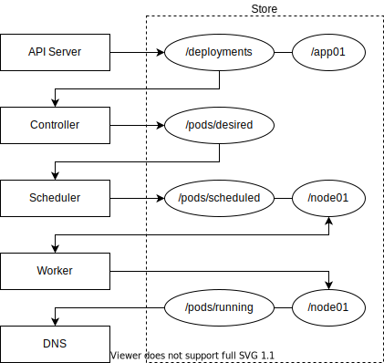

# Orchestra [](https://github.com/marella/orchestra/actions/workflows/build.yml)

A basic container orchestration tool written in Java. It uses ZooKeeper for storing data, Docker for running containers and CoreDNS for service discovery.

## Architecture

<div align="center">



</div>

### Store

ZooKeeper is used for storing the state and configuration of cluster. All services "communicate" with each other by reading and writing data to the store. It is also used by master nodes for leader election.

### API Server

The API server allows users to perform CRUD operations on deployments. Users can specify the deployment name, image and number of replicas for a deployment. Each deployment is also assigned a hash so that the controller service can detect changes in the deployment.

### Controller

The controller service reads the deployments created through the API server and creates or deletes the pods accordingly. Each pod is also assigned a unique ID.

### Scheduler

The scheduler service reads the pods created by the controller service and assigns them to the worker nodes.

### Worker

The worker service runs on each worker node and reads the pods assigned by the scheduler service and creates or deletes the containers accordingly using Docker. It also maintains a list of running pods and their IP addresses in the store.

### DNS

The DNS service reads the running pods and their IP addresses created by each worker service and writes them to the zone file served by CoreDNS.

## Usage

Start:

```sh
make up
```

Stop:

```sh
make down
```

Create or update deployment:

```sh
make deploy name=nginx image=nginx:alpine replicas=2
```

Get deployments:

```sh
make get
```

Delete deployment:

```sh
make delete name=nginx
```
